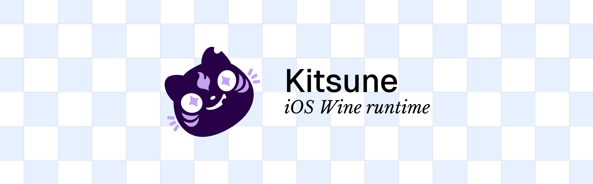

<p align="center">
  
</p>

Kitsune is a port of [Wine](https://www.winehq.org) that runs on iOS through JIT and lets you run Steam games and x86 apps.
It's just WIP for now and more work has to be done.

## Currently booting

| App | State |
|---|---|
| Steam | Fully working login, install and launch |
| Dark Souls Remastered | Running in game, playable |
| Blasphemous | Runs in game, 60fps with dips here and there |
| Cuphead | Runs in game, 60fps with dips here and there |

## Stack

- Wine's unix side is compiled for arm64-apple-ios.
- x86-64 code is translated by [FEX](https://github.com/FEX-Emu/FEX) through ARM64EC.
- Direct3D 11 runs on Metal through [DXMT](https://github.com/3Shain/dxmt).

## How to use

1. Using iLoader or SideStore install the unsigned ipa of Kitsune.
2. Then either use StikDebug in LiveContainer or sideload StikDebug.
3. Install LocalDevVPN and enable it.
4. Copy `kitsune.js` from the Kitsune folder in Files to the StikDebug scripts folder.
5. Open StikDebug and longpress on Kitsune to assign the `kitsune.js` script to allow for JIT.
6. Launch Kitsune.
7. Install Steam.
8. Allow Steam to open StikDebug and allow JIT.
9. Wait up to 2 minutes to let Steam run, then login, install games and launch.

## Caveats

- Steam takes a lot of memory, so you may find it easier to install through Steam, kill the app and relaunch through the library. It launches Steam in silent mode, without rendering the UI, which reserves more memory for the games.
- Memory is very limited for apps on iOS without special entitlements.

## Build from source

To build you need a Mac with Apple silicon, Xcode, Homebrew and about 16 GB of free disk.

```sh
cp local.env.example local.env   # your Apple team and a bundle id registered to it
scripts/setup.sh                 # checks available space and installed stuff, then it fetches external dependencies and compiles them
scripts/app.sh ipa               # builds the app and outputs an ipa ready to install
```

To reiterate on development:

```sh
scripts/app.sh install --full    # full build and coredevice install with usb cable or network
scripts/app.sh install           # progressive build and install with usb cable or network
```

`scripts/setup.sh` resumes where it stopped and skips finished steps, and
`scripts/setup.sh --check` checks the Mac without building.
[docs/building.md](docs/building.md) covers every step, thin app updates and
release IPAs.

## Documentation

- [Architecture](docs/architecture.md): how one iOS process runs Wine
- [Building](docs/building.md): the setup script, every build step, the app and releases
- [Device](docs/device.md): JIT, launching, logs and test switches
- [Status](docs/status.md): what works, the limits, what's next
- [Contributing](CONTRIBUTING.md): setup, commit format, working on the ports, tests

## Acknowledgements

Thanks to obviously Wine, FEX and DXMT for their work.
Thanks to [Madeira](https://github.com/willfaust/Madeira) from willfaust: the
soft pools for CEF, the per-process fd cache, the in-process NSI fallback and
the BC texture fallback in DXMT are adapted from it
([what and from where](LICENSES/README.md#code-adapted-from-madeira)).

This project leveraged AI usage, this is a personal passion project.
